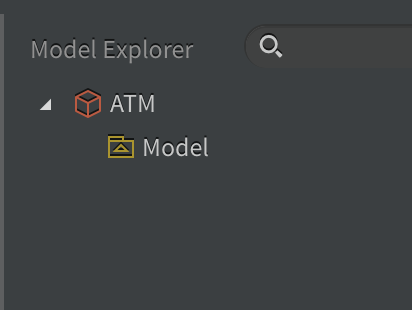
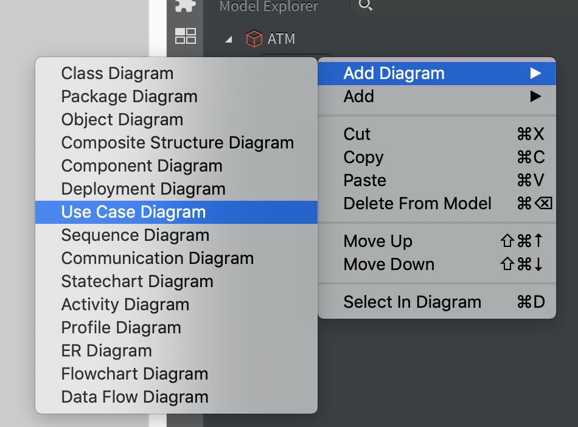
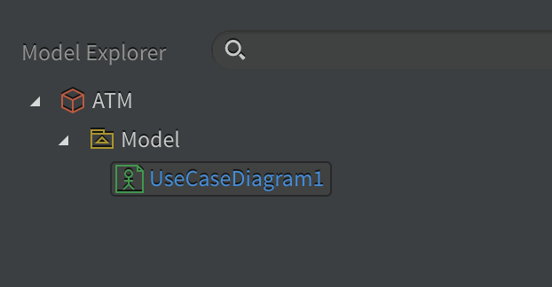
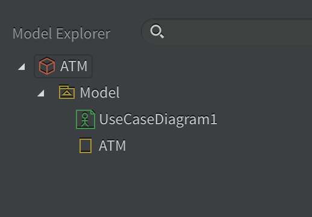
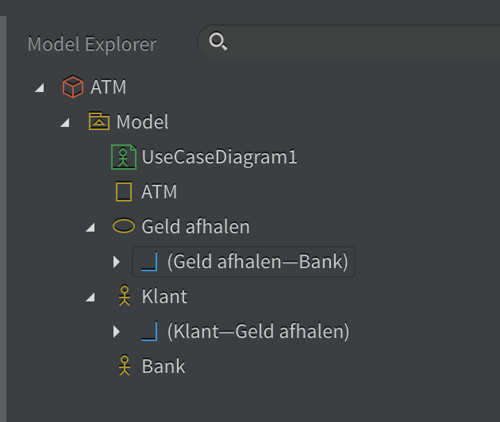

# Use Case Diagram

## Voorbeeld: ATM

(Analyse & UML – Lars De Richter – Thomas More)

---

## Use Case Diagram toevoegen

- Open StarUML. <!-- .element class="fragment" -->
- Geef je ‘package’ de naam ‘ATM’. <!-- .element class="fragment" -->
- Voeg een Use Case Diagram toe aan het Model. <!-- .element class="fragment" -->

&&&

notes:

Klikken op `Untitled` >> rechtsonderaan bij `properties` het veld `name` veranderen in ATM

&&&

notes:

- Rechts klikken op `Main` >> klikken op `Delete from model`
- Rechts klikken op `Model` >> hoveren over `Add Diagram` >> klikken op `Use Case Diagram`

&&&

---

## Het systeem

- Het systeem (of in StarUML: Use Case Subject) wordt voorgesteld door een rechthoek met de naam van het systeem. <!-- .element class="fragment" -->
- Alles binnen de rechthoek is deel van het systeem. <!-- .element class="fragment" -->
- Wat er rond staat hoort niet bij het systeem, maar interageert ermee. <!-- .element class="fragment" -->

Notes:

In een Use Case Diagram is het systeem een zogenaamde ‘Black Box’. Hoe het systeem iets doet/een opdracht vervult, interesseert ons nog niet. Enkel wat het systeem moet kunnen tonen we op een overzichtelijke manier met een Use Case Diagram.

&&&

<!-- .slide: data-background-image="images/use-case-diagram-04.png" data-background-size="contain" -->

Notes:

Klik linksonderaan bij `Toolbox` op `Use Case Subject` >> teken een rechthoek met je muisknop ingedrukt >> vul ‘ATM’ in als `UseCaseSubject`

&&&

De Model Explorer ziet er nu zo uit:

---

## Actor

- Wie gaat met het systeem werken? <!-- .element class="fragment" -->
- Wie zijn de gebruikers? <!-- .element class="fragment" -->
- Wie heeft voordeel bij dit systeem? <!-- .element class="fragment" -->

**Dat worden de actoren.** <!-- .element: class="fragment" -->

Notes:

Het is belangrijk hierbij om te focussen naar de rol van de gebruiker, niet de individuele gebruikers. Dezelfde persoon kan soms meerdere rollen hebben bijv. in een krantenwebsite zal Yves soms een schrijver zijn en soms een redacteur, maar John is enkel een schrijver. Als schrijver zullen zij dezelfde dingen willen doen met het systeem (bijv. artikels schrijven en klaarzetten voor nazicht door een redacteur), maar als redacteur zal Yves andere dingen willen doen (bijv. artikel nakijken en publiceren) dan als schrijver.

&&&

In een Use Case Diagram wordt een actor voorgesteld door een stokpoppetje.

&&&

<!-- .slide: data-background-image="images/use-case-diagram-06.png" data-background-size="contain" -->

Notes:

Klik links onderaan bij `Toolbox` op `Actor` >> klik in het diagram ongeveer waar je de actor wil hebben >> geef de gepaste naam >> verplaatsen kan door te slepen

---

## Use Case

- Wat wil de gebruiker met het systeem doen? <!-- .element class="fragment" -->
- Wat moet het systeem kunnen voor de gebruiker? <!-- .element class="fragment" -->
- Hoe maakt het systeem het leven van de gebruiker makkelijker? <!-- .element class="fragment" -->

**Dat worden de use cases** <!-- .element class="fragment" -->

&&&

- De use cases worden voorgesteld door een elips met een duidelijke naam erin. <!-- .element class="fragment" -->
- Het zijn dingen die de actor met het systeem doet, meestal bevatten ze dus een werkwoord. <!-- .element class="fragment" -->
- De use cases zijn functionaliteiten van het systeem, ze worden dus in de rechthoek getekend. <!-- .element class="fragment" -->

&&&

<!-- .slide: data-background-image="images/use-case-diagram-07.png" data-background-size="contain" -->

Notes:

Klik links onderaan bij `Toolbox` op `Use Case` >> klik in de rechthoek ongeveer waar je de use case wil hebben >> geef een duidelijke/sprekende naam die je op een bondige manier al een goed idee geeft van waarover de use case zal gaan >> verplaatsen kan later nog door de use case te verslepen.

---

## Relaties

- We moeten nog aangeven bij welke actor een use case hoort. <!-- .element class="fragment" -->
- Dat doen we door een relatie te leggen. <!-- .element class="fragment" -->
- Er bestaan verschillende soorten relaties. <!-- .element class="fragment" -->
- Gewone association is voor ons meestal voldoende. <!-- .element class="fragment" -->

&&&

<!-- .slide: data-background-image="images/use-case-diagram-08.png" data-background-size="contain" -->

Notes:

Klik links onderaan bij `Toolbox` op `Association` >> klik op de actor en sleep (houd muisknop ingedrukt!) naar de bijbehorende use case

---

## Secundaire actoren

- De voorgaande actoren zijn primaire actoren. <!-- .element class="fragment" -->
- Primaire actor initieert (start) de actie van een use case. Actief. <!-- .element class="fragment" -->
- Secundaire actor is betrokken bij de actie of wordt erdoor geïmpacteerd. Reactief of passief. <!-- .element class="fragment" -->

&&&

- Primaire actoren staan links van het systeem
- Secundaire actoren staan rechts van het systeem

&&&

Wie of wat zou een secundaire actor zijn bij een ATM?

Notes:

Actoren zijn niet altijd mensen. Zeker secundaire actoren zijn vaak andere systemen.

Zeker in deze fase is het niet van levensbelang om de secundaire actoren te identificeren, maar voor de volledigheid wil ik ze hier toch vermelden.

&&&

<!-- .slide: data-background-image="images/use-case-diagram-09.png" data-background-size="contain" -->

Notes:

De relatie loopt hier van de use case naar de secundaire actor.

---

## StarUML Model Explorer

Zo zou je Model Explorer er moeten uit zien

Notes:

- Zo zou je Model Explorer er moeten uit zien
- Dingen verwijderen doe je best met je rechter muisknop in de Model Explorer, niet in het diagram

---

## Verder

We denken samen verder na over welke actoren en use cases nog toegevoegd moeten worden. <!-- .element class="fragment" -->

Notes:

Op Canvas vind je mijn voorstel van een uitgewerkt Use Case Diagram voor een eenvoudige ATM. Analyse is geen juist/fout gegeven. Twee personen of twee teams kunnen voor een gelijkaardig systeem toch verschillende analyses maken. Zolang je team streeft naar volledigheid en eenduidigheid, zit je al aardig op de goede weg.

---

## Use Cases

- Uiteraard ontbreken er nu nog heel wat details. <!-- .element class="fragment" -->
- Een Use Case Diagram geeft slechts een schematisch overzicht van wat een systeem moet kunnen (= de functionele vereisten); <!-- .element class="fragment" -->
- de use cases zelf zullen we volgende les verder beschrijven met tekst, maar wel volgens een vaste structuur. <!-- .element class="fragment" -->

---

## Licentie

Deze slides werden gemaakt door [Lars De Richter](mailto:lars.derichter@thomasmore.be) voor het Graduaat Programmeren aan [Thomas More.](http://thomasmore.be)

Beschikbaar onder de onder de volgende Creative Commons licentie: [Naamsvermelding-NietCommercieel-GelijkDelen 4.0 Internationaal (CC BY-NC-SA 4.0)](https://creativecommons.org/licenses/by-nc-sa/4.0/deed.nl).
