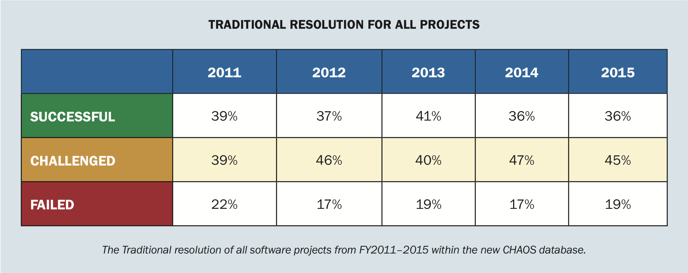

# Analyse & UML

---

## Rollenspel

&&&

<!-- .slide: data-background-image="images/swing.jpg" data-background-size="contain" -->

&&&

[Tree Swing Cartoon Pictures](https://www.businessballs.com/amusement-stress-relief/tree-swing-cartoon-pictures-early-versions/)

---

## Kwaliteit van software projecten

---

Hoeveel IT-projecten

- binnen de deadline, binnen budget met alle functionaliteiten?
- falen compleet? (niet opgeleverd of nooit gebruikt)
- over tijd / boven budget / voldoen niet helemaal?

&&&

(Standish Group, 2015) <!-- .element: class="cite" -->

&&&

<!-- .slide: data-background-image="images/chaos-2.png" data-background-size="contain" -->

(Standish Group, 2015) <!-- .element: class="cite fragment" -->

&&&

### Oorzaken

Oorzaak die steeds terug komt: ‘Incomplete requirements’ <!-- .element: class="fragment" -->

(opendoor technology, 2019) <!-- .element: class="cite fragment" -->

---

## Geen/gebrekkige analyse

&&&

<!-- .slide: data-background-image="images/door.jpg" data-background-size="contain" -->

[pixmus.net](http://piximus.net/media/17830/fail-and-win-171-11.jpg) <!-- .element: class="cite fragment" -->

&&&

<!-- .slide: data-background-image="images/staircase.jpg" data-background-size="contain" -->

[You had one job. B35 rear staircase.](https://imgur.com/KXgTHRE) <!-- .element: class="cite fragment" -->

&&&

<!-- .slide: data-background-image="images/cupboard.jpg" data-background-size="contain" -->

[reddit u/Tokoyoshi](https://www.reddit.com/r/funny/comments/17bsrk/you_had_one_job/) <!-- .element: class="cite fragment" -->

&&&

- [Ugly Belgian Houses](https://uglybelgianhouses.tumblr.com/)
- [You had one job](https://hadonejob.com/)
- [UX fails](https://www.pinterest.com/uxfails/ux-fails/)

---

## Analyse

&&&

- Requirements kennen <!-- .element: class="fragment" -->
- Plan zo opmaken en communiceren dat er geen ruimte voor interpretatie is <!-- .element: class="fragment" -->

---

## Requirements

&&&

- mogelijkheden van het systeem <!-- .element: class="fragment" -->
- voorwaarden/beperkingen op hoe die toegepast worden <!-- .element: class="fragment" -->
- externe gedrag van het systeem <!-- .element: class="fragment" -->

&&&

### Twee soorten eisen

- functionele: wat moet het systeem kunnen voor de gebruiker = functionaliteit & gegevens <!-- .element: class="fragment" -->
- niet-functionele: randvoorwaarden = kwaliteit & beperkingen <!-- .element: class="fragment" -->

---

## Plan maken

&&&

- Requirements analyse <!-- .element: class="fragment" -->
- Event Storming <!-- .element: class="fragment" -->
- User Story Mapping <!-- .element: class="fragment" -->

---

## Plan communiceren

&&&

- UML (Unified Modelling language) diagrammen <!-- .element: class="fragment" -->
- User stories <!-- .element: class="fragment" -->
- User story maps <!-- .element: class="fragment" -->

---

## Bronnen

- Opendoor Technology (2019) _The Standish Group report 83.9% of IT projects partially or completely fail_ Retrieved February 6, 2020, from https://www.opendoorerp.com/the-standish-group-report-83-9-of-it-projects-partially-or-completely-fail/

&&&

- Standish Group. (2015) _Chaos Report 2015._ Retrieved February 6, 2020, from https://www.standishgroup.com/sample_research_files/CHAOSReport2015-Final.pdf

&&&

- Verboven, Michiel. (2019) _Analyse. Eisenanalyse en UML_ [presentatie].

---

## Licentie

Deze slides werden gemaakt door [@lars-derichter](https://github.com/lars-derichter)

Beschikbaar onder de onder de volgende Creative Commons licentie: [Naamsvermelding-NietCommercieel-GelijkDelen 4.0 Internationaal (CC BY-NC-SA 4.0)](https://creativecommons.org/licenses/by-nc-sa/4.0/deed.nl).
