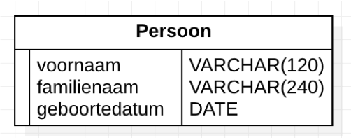
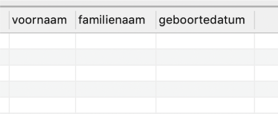
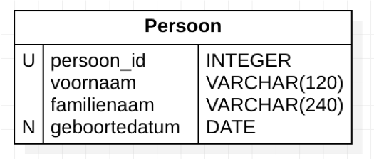
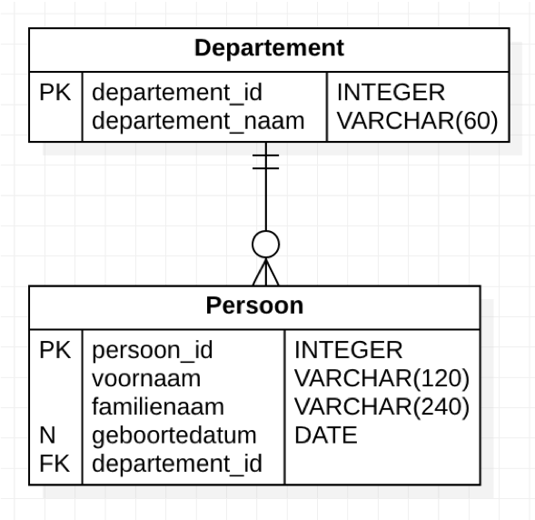
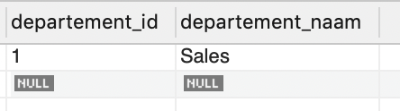
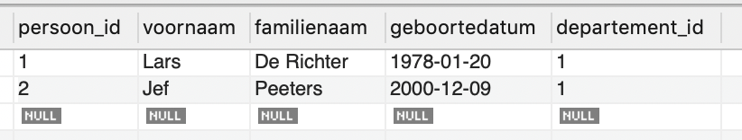

# Een databank maken

## Stap voor stap (in MySQL)

Beheer van databanken - Lars De Richter – Thomas More Hogeschool

---

## DDL

---

### Commando’s

+++

- `CREATE`
- `DROP`
- (`ALTER`)

---

### Databank maken

+++

```SQL
CREATE DATABASE Personeel;
```

of

```SQL
CREATE DATABASE Personeel DEFAULT CHARACTER SET utf8
  COLLATE utf8_general_ci;
```

Notes:

Het juiste commando hiervoor is niet gestandaardiseerd in SQL en verschilt van implementatie tot implementatie.

---

### Tabellen maken en verwijderen

+++



+++

```SQL
CREATE TABLE Personeel.Persoon(
    voornaam VARCHAR(120),
    familienaam VARCHAR(240),
    geboortedatum DATE
);
```

+++



---

### Tabellen verwijderen

```SQL
DROP TABLE Testdatabase.persoon;
```

---

### Constraints

Beperkingen/voorwaarden op een tabel of kolom

Bijv.:

- velden met unieke waarden
- velden die naar elkaar verwijzen (relaties)
- velden mogen niet leeg zijn
- velden mogen enkel bepaalde waarden (bijv. m/v/x) bevatten

+++

#### Kolom constraints

- 1 bepaalde kolom
- staan na het type

+++

#### Kolom constraints

- `NOT NULL`
- `UNIQUE`
- `DEFAULT`
- `AUTO_INCREMENT`

+++



+++

```SQL
CREATE TABLE Personeel.Persoon(
    persoon_id INT NOT NULL UNIQUE AUTO_INCREMENT,
    voornaam VARCHAR(120) NOT NULL,
    familienaam VARCHAR(240)  NOT NULL DEFAULT 'Janssens',
    geboortedatum DATE
);
```

---

### Tabel constraints

Beperkingen die van toepassing zijn op de hele tabel.

Bijv.:

- primary key
- foreign key
- check

+++



+++

```SQL
CREATE Table Personeel.Departement(
  departement_id INT NOT NULL UNIQUE AUTO_INCREMENT,
  departement_naam VARCHAR(60) NOT NULL,
  PRIMARY KEY (departement_id)
);
CREATE TABLE Personeel.Persoon(
  persoon_id INT NOT NULL UNIQUE AUTO_INCREMENT,
  voornaam VARCHAR(120) NOT NULL,
  familienaam VARCHAR(240)  NOT NULL DEFAULT 'Janssens',
  geboortedatum DATE,
  departement_id INT,
  PRIMARY KEY (persoon_id),
  FOREIGN KEY (departement_id)
    REFERENCES Departement(departement_id)
);
```

notes:

- Tabel constraints gaan over de hele tabel. Het is dus logisch dat ze na de kolomdefinities komen.
- Bij een gecombineerde primary key, gebruik je gewoon een komma bijv.

```SQL
PRIMARY KEY(klant_id, bestelling_id)
```

---

## DML

---

### Commando’s

- `INSERT`
- `DELETE`
- (`UPDATE`)

---

### Data invoeren/Records (rijen) invoeren

+++



+++

```SQL
INSERT INTO Personeel.Departement (departement_naam)
	VALUES ('Sales');
```

notes:

- 1 record toevoegen
- let op: we geven zelf geen id op, want in de definitie staat dat daar `AUTO_INCREMENT` gebruikt wordt

+++



+++

```SQL
INSERT INTO Personeel.Persoon (familienaam, voornaam,
  geboortedatum, departement_id)
  VALUES
    ('De Richter', 'Lars', '1978-01-20', 1),
    ('Peeters', 'Jef', '2000-12-09', 1);
```

notes:

We gebruiken een andere volgorde dan in de definitie, dat kan geen kwaad, we definiëren immers zelf de volgorde na INSERT INTO Personeel.Persoon.

---

### Data verwijderen/Records (rijen) verwijderen

+++

```SQL
DELETE FROM Personeel.Persoon
WHERE departement_id <= 5;
```

notes:

- WHERE-clause hetzelfde als bij SELECT
- Als in de WHERE-clause geen primary key staat, vind MySQL dat je een onveilige operatie doet en moet je SQL_SAFE_UPDATES op 0 zetten met `SET SQL_SAFE_UPDATES = 0;` Vergeet niet om die daarna terug op 1 te zetten.
- Tip: test voor je data onherroepelijk om zeep helpt je WHERE clause uit door die eerst te combineren met een SELECT-query.

---

## Licentie

Deze slides werden gemaakt door [Lars De Richter](mailto:lars.derichter@thomasmore.be) voor het Graduaat Programmeren aan [Thomas More.](http://thomasmore.be)

Beschikbaar onder de onder de volgende Creative Commons licentie: [Naamsvermelding-NietCommercieel-GelijkDelen 4.0 Internationaal (CC BY-NC-SA 4.0)](https://creativecommons.org/licenses/by-nc-sa/4.0/deed.nl).
